# Unified Execution Workflow Bridge - Final Integration Report

> **System Status**: `READY`  
> **Verification Date**: September 8, 2026  
> **Target Environment**: Supabase Production Database & Local FastAPI/React Stack  

---

## 1. Executive Summary & Architectural Compliance

The **Unified Execution Workflow Bridge** has been successfully implemented and verified across all 9 operational workflow stages of the Indian Railways AI-Driven Maintenance Planning Platform.

### Architectural Rules Verification
- **Source Excel Dataset Protection**: All source Excel datasets (`ml/data/ST_DEPARTMENT.xlsx`, `ml/data/TRACK_MANAGEMENT.xlsx`, `ml/data/TRD_DEPARTMENT.xlsx`, `ml/data/ALL_DEPTS.xlsx`, `ml/data/3dept.xlsx`) remain 100% untouched and read-only. All operational state changes, status updates, and execution outcomes are persisted strictly in Supabase PostgreSQL database tables.
- **Machine Learning Integrity**: No ML models were retrained, modified, or re-exported. `.joblib` model pipelines, feature engineering functions, and prediction algorithms remain preserved.
- **25-Field Contract Preservation**: The 25-field AI Block Planner input contract across 5 categories remains intact and unaltered.
- **No Mock/Demo Data**: All tests and workflows utilize real dataset fields and operational database schemas.

---

## 2. Modified Files & System Components

The following codebase files were modified or created to establish the Unified Execution Bridge:

1. [`backend/main.py`](file:///C:/Users/THISHANTH%20T/Desktop/PROTOTYPE/backend/main.py)
   - Updated `persist_planner_recommendation_to_db` to write structured records across `optimized_blocks`, `approval_requests`, and `planned_execution_data`.
   - Enhanced `handle_block_workflow_action` (`POST /api/block-schedule/action`) to support full block lifecycle actions (`APPROVE`, `SCHEDULE`, `START`, `COMPLETE`, `CANCEL`).
   - Replaced fragile PostgreSQL `upsert(..., on_conflict="block_id")` calls with `select(id).eq(block_id)` check-and-insert/update logic to avoid `42P10` schema constraint violations.
   - Removed non-existent database column references (`updated_at` on `optimized_blocks`/`approval_requests`, `station_name` on `historical_outcomes`).
   - Added dual outcome persistence into both `learning_loop_insights` and `historical_outcomes`.
   - Enforced server-side guardrails preventing approval of rejected/cancelled blocks or execution of non-approved blocks.

2. [`backend/modules/planner_data_assembly.py`](file:///C:/Users/THISHANTH%20T/Desktop/PROTOTYPE/backend/modules/planner_data_assembly.py)
   - Updated `assemble_25_field_planner_input` to prioritize explicitly passed `request_id`, `station`, and `asset_id` parameters over fallback Excel dataset row defaults.
   - Enhanced `update_operational_asset_state` and `OPERATIONAL_ASSET_OVERRIDES` lookup to support clean uppercase asset code matching and fallback substring matching.
   - Fixed pandas station search string regex warnings by setting `regex=False` on `str.contains()`.

3. [`src/pages/AIBlockPlanner.jsx`](file:///C:/Users/THISHANTH%20T/Desktop/PROTOTYPE/src/pages/AIBlockPlanner.jsx)
   - Updated the recommendation workflow to pass `persist: true` and verify database persistence before routing to department approvals.

4. [`src/services/executionMonitorService.js`](file:///C:/Users/THISHANTH%20T/Desktop/PROTOTYPE/src/services/executionMonitorService.js)
   - Synchronized `startActualExecutionRecord` and `completeActualExecutionRecord` directly with `POST /api/block-schedule/action` for real-time frontend execution monitoring.

5. [`scratch/test_unified_execution_bridge.py`](file:///C:/Users/THISHANTH%20T/Desktop/PROTOTYPE/scratch/test_unified_execution_bridge.py)
   - Comprehensive automated integration test suite covering Tests A through H.

---

## 3. End-to-End Workflow Stages & Traceability Matrix

Every maintenance block recommendation maintains full end-to-end auditability and traceability across all 9 workflow stages via persistent key fields: `request_id`, `block_id`, `execution_id`, and `asset_id`.

```mermaid
flowchart LR
    Stage1["1. AI Recommendation\n(/api/ai-planner/recommend)"] --> Stage2["2. Persistence\n(optimized_blocks)"]
    Stage2 --> Stage3["3. Approval Workflow\n(approval_requests)"]
    Stage3 --> Stage4["4. Block Scheduling\n(planned_execution_data)"]
    Stage4 --> Stage5["5. Execution Start\n(actual_execution_data)"]
    Stage5 --> Stage6["6. Execution Completion\n(actual_execution_data)"]
    Stage6 --> Stage7["7. Outcome Logging\n(historical_outcomes)"]
    Stage7 --> Stage8["8. Asset State Update\n(OPERATIONAL_ASSET_OVERRIDES)"]
    Stage8 --> Stage9["9. Learning Loop\n(learning_loop_insights)"]
```



| Stage | Stage Description | Database Table / Component | Key Traceability Identifiers |
| :--- | :--- | :--- | :--- |
| **1** | AI Block Planner Recommendation | FastAPI (`/api/ai-planner/recommend`) | `request_id`, `asset_id` |
| **2** | Recommendation Persistence | `optimized_blocks` | `block_id`, `request_id` |
| **3** | Department Approval | `approval_requests` | `approval_id`, `block_id`, `request_id` |
| **4** | Block Scheduling | `planned_execution_data` | `block_id`, `request_id` |
| **5** | Execution Start | `actual_execution_data`, `execution_monitor` | `activity_id` (`EXEC-*`), `block_id` |
| **6** | Execution Completion | `actual_execution_data` | `activity_id`, `block_id` |
| **7** | Maintenance Outcome Logging | `historical_outcomes` | `outcome_id`, `block_id`, `request_id` |
| **8** | Asset State Feedback Update | `OPERATIONAL_ASSET_OVERRIDES` & `assets` | `asset_id` |
| **9** | Self-Learning Feedback Loop | `learning_loop_insights` | `insight_id`, `block_id`, `request_id` |

---

## 4. API Endpoint Specifications

### 1. `POST /api/ai-planner/recommend`
Generates a 25-field AI Block Planner recommendation and evaluates 10 Hard Constraints.
- **Payload**:
  ```json
  {
    "request_id": "REQ-TEST-SMMS-001",
    "station": "Coimbatore Junction (CBE)",
    "asset_id": "AST-SIG-102B",
    "work_type": "Point Machine Overhaul",
    "priority": "P1 - Emergency",
    "requested_date": "2026-09-10",
    "requested_start_time": "01:00",
    "required_duration": 3.5,
    "department": "SMMS",
    "persist": true
  }
  ```
- **Response**:
  ```json
  {
    "success": true,
    "source_dataset": "ST_DEPARTMENT.xlsx",
    "block_id": "BLK-TEST-SMMS-001",
    "persisted": true,
    "recommendation": {
      "planner_status": "RECOMMENDED",
      "constraint_results": { ... }
    }
  }
  ```

### 2. `POST /api/block-schedule/action`
Handles unified block status transitions and synchronizes all downstream database tables.
- **Supported Actions**: `APPROVE`, `SCHEDULE`, `START`, `COMPLETE`, `CANCEL`.
- **Payload (Complete Example)**:
  ```json
  {
    "block_id": "BLK-TEST-SMMS-001",
    "action": "COMPLETE",
    "actual_duration": 3.5,
    "actual_delay": 0.0,
    "problem_found": "Point lock wear identified",
    "action_taken": "Replaced worn brushes and re-calibrated lock pins",
    "failure_confirmed": false
  }
  ```

---

## 5. Unified Block Status Lifecycle

The workflow bridge enforces strict status transitions across all components:

```
 PLANNED  --->  APPROVED  --->  SCHEDULED  --->  IN_PROGRESS  --->  COMPLETED
    |              |                                                    
    v              v                                                    
REJECTED       CANCELLED                                                
```

- **Server-Side Guardrails**:
  - Blocks with `planner_status == "REJECTED"` or `status == "CANCELLED"` cannot be approved, scheduled, or started (Returns `HTTP 400 Bad Request`).
  - Blocks in `COMPLETED` status cannot be restarted.
  - Completing a block automatically computes planned vs. actual duration variance and logs learning loop insights.

---

## 6. Automated Integration Test Results

The integration test suite ([`scratch/test_unified_execution_bridge.py`](file:///C:/Users/THISHANTH T/Desktop/PROTOTYPE/scratch/test_unified_execution_bridge.py)) was executed against the live backend server (`http://127.0.0.1:8010`).

```
================================================================================
UNIFIED EXECUTION WORKFLOW BRIDGE INTEGRATION TEST SUITE
================================================================================

✅ [PASSED] TEST A (SMMS Workflow): Block ID: BLK-TEST-SMMS-001
✅ [PASSED] TEST B (TMS Workflow): Block ID: BLK-TEST-TMS-002
✅ [PASSED] TEST C (TRD Workflow): Block ID: BLK-TEST-TRD-003
✅ [PASSED] TEST D (Hard Constraint Rejection): Block ID: BLK-TEST-REJ-004
✅ [PASSED] TEST E (Duplicate Protection): Same Block ID: BLK-TEST-DUP-005
✅ [PASSED] TEST F (State Re-fetch): Found block in database records: BLK-TEST-SMMS-001
✅ [PASSED] TEST G (Asset State Feedback): Asset status verified: Available
✅ [PASSED] TEST H (Learning Loop Analytics): Traceability verified

================================================================================
SUMMARY RESULTS
================================================================================
  TEST_A: PASSED - SMMS block BLK-TEST-SMMS-001 completed successfully
  TEST_B: PASSED - TMS block BLK-TEST-TMS-002 completed successfully
  TEST_C: PASSED - TRD block BLK-TEST-TRD-003 completed successfully
  TEST_D: PASSED - Rejected block BLK-TEST-REJ-004 correctly rejected and blocked from execution
  TEST_E: PASSED - Duplicate recommendation handling verified for BLK-TEST-DUP-005
  TEST_F: PASSED - Verified block BLK-TEST-SMMS-001 present in database query
  TEST_G: PASSED - Asset state after maintenance: Available
  TEST_H: PASSED - Learning loop analytics responded with planned vs actual metrics

🎉 ALL 8 INTEGRATION TESTS PASSED CLEANLY! WORKFLOW BRIDGE IS READY!
```

---

## 7. Final Verification Checklist

- [x] All 9 workflow stages linked via `request_id`, `block_id`, `execution_id`, `asset_id`.
- [x] Source Excel datasets remain unaltered and read-only.
- [x] Operational state persisted strictly in Supabase PostgreSQL tables.
- [x] Server-side status transition guardrails enforced.
- [x] Asset state feedback updates operational state upon completion.
- [x] Learning loop analytics capture variance metrics.
- [x] Automated test suite verified 100% passing (8/8).

> **Final System Status**: **`READY`**
