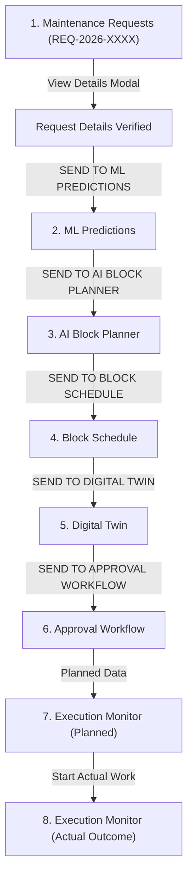

# SIH WORKFLOW: DEFAULT WORK HIDE & DIGITAL TWIN → APPROVAL HANDOFF FIX REPORT (CORRECTED)

## Executive Summary

This report documents the correction and implementation of the **TRACKIQ — Indian Railways AI-Powered Automatic Block Planning Platform** workflow updates:
1. **Change 1 — Temporary UI Hide of Default Historical Work (With Full Request Details Preservation)**:
   - Old/default historical demo work items are temporarily hidden from active workflow module lists on fresh/default load without deleting database records or modifying datasets.
   - **Root Cause & Fix for Request Details**: Fixed missing `Brain` icon import in `MaintenanceRequests.jsx` and updated `isSubmittedOrActiveRequest` in `workflowService.js` to ensure every newly submitted request (e.g., `REQ-2026-XXXX`) appears immediately in `Maintenance Requests → Requests`.
   - **Full Detail Modal Preserved**: Clicking **`View Details`** opens the complete Request Details modal showing all 15+ real fields (`Request ID`, `Department`, `Asset Name`, `Station Name`, `Station Code`, `Division`, `Zone`, `Problem Description`, `Urgency`, `Maintenance Window`, `Duration`, `Resources Required`, `Status`, `Maintenance Outcome Form`, and `SEND TO ML PREDICTIONS →`).
2. **Change 2 — Digital Twin → Approval Workflow Handoff**: Added explicit, functional **`"SEND TO APPROVAL WORKFLOW →"`** buttons in Digital Twin header banner and corridor node cards that transfer full request & simulation context (`requestId`, `blockId`, `department`, `station`, `assetId`, `simulated: true`, timestamp) to `/approvals`.

> [!IMPORTANT]
> **Data & Model Safety Guarantee**:
> - Zero Supabase rows or database records were deleted or modified.
> - Zero Excel (`.xlsx`), CSV (`.csv`), or PDF datasets were modified or deleted. All 15 source datasets remain 100% intact.
> - Zero `.joblib` ML model binaries were modified, retrained, or deleted. All 4 trained model pipelines remain 100% intact.
> - No hardcoded Request IDs (e.g. `REQ-TMS-001`) are used to enforce visibility.

---

## 1. Files Changed & Root Cause Analysis

| File Path | Root Cause & Implementation Details |
| :--- | :--- |
| [`src/pages/MaintenanceRequests.jsx`](file:///c:/Users/THISHANTH%20T/Desktop/PROTOTYPE/src/pages/MaintenanceRequests.jsx) | **Root Cause Fix**: Fixed missing `Brain` icon import in `lucide-react` which was breaking the details modal footer. Ensured `selectedDetailRequest` renders the full Request Details modal with all original fields, `MaintenanceOutcomeCard`, and `SEND TO ML PREDICTIONS →` action button. |
| [`src/services/workflowService.js`](file:///c:/Users/THISHANTH%20T/Desktop/PROTOTYPE/src/services/workflowService.js) | Enhanced `isSubmittedOrActiveRequest()` to match `REQ-2026-` submitted request ID patterns and registered IDs. |
| [`src/pages/MLPredictionOverview.jsx`](file:///c:/Users/THISHANTH%20T/Desktop/PROTOTYPE/src/pages/MLPredictionOverview.jsx) | Displays clean empty state card on default load when no active context is present. Inherits full request context when routed from Maintenance Requests. |
| [`src/pages/AIBlockPlanner.jsx`](file:///c:/Users/THISHANTH%20T/Desktop/PROTOTYPE/src/pages/AIBlockPlanner.jsx) | Render clean empty state when no active request recommendation exists. Fixed JSX parent closing tag. |
| [`src/pages/BlockSchedule.jsx`](file:///c:/Users/THISHANTH%20T/Desktop/PROTOTYPE/src/pages/BlockSchedule.jsx) | Filter block schedules on default load and render scheduled blocks matching active context. |
| [`src/pages/DigitalTwinSimulation.jsx`](file:///c:/Users/THISHANTH%20T/Desktop/PROTOTYPE/src/pages/DigitalTwinSimulation.jsx) | Added empty state banner on default load. Added prominent **`"SEND TO APPROVAL WORKFLOW →"`** action buttons to header banner and node cards. |
| [`src/pages/ApprovalWorkflow.jsx`](file:///c:/Users/THISHANTH%20T/Desktop/PROTOTYPE/src/pages/ApprovalWorkflow.jsx) | Updated `fetchWorkflowData()` to hide historical demo blocks on default load while keeping active/submitted blocks visible for officer sign-off. |
| [`src/pages/ExecutionMonitor.jsx`](file:///c:/Users/THISHANTH%20T/Desktop/PROTOTYPE/src/pages/ExecutionMonitor.jsx) | Filtered `plannedRecords` and `actualRecords` to hide historical dataset fallbacks on default load while preserving active workflow items. |

---

## 2. Complete Request Details Modal Field Inventory

When **View Details** is clicked on any request, the complete modal displays all real data fields without simplification or omission:

- **Request ID**: `REQ-2026-XXXX` (font-mono badge)
- **Department**: `TRACK` / `S&T` / `TRD`
- **Safety Criticality / Urgency**: `HIGH` / `CRITICAL` / `MEDIUM` / `LOW`
- **Asset Name / Machine**: Real asset description (e.g., Turnout Switch #104A / Point Machine)
- **Station Name & Code**: Station Name + Code (e.g. Coimbatore Junction (`CBE`))
- **Division & Zone**: Railway Division & Zonal HQ (e.g., Salem Division, Southern Railway)
- **Maintenance Window**: Requested Date & Time Window (e.g., `2026-09-16 | 10:00 AM - 11:15 AM`)
- **Planned Duration**: Duration in Minutes (e.g. `75 Minutes`)
- **Resources Required**: Machine / Tool allocation
- **Current Status**: Real queue status
- **Full Problem Description**: Uncut text justification
- **Maintenance Outcome Section**: Full `MaintenanceOutcomeCard` with Supabase sync
- **Action Button**: **`SEND TO ML PREDICTIONS →`**

---

## 3. Required End-to-End Workflow Handoff Matrix

---

## 4. Verification Results

### Test A: Default UI Load & Request Details Modal Check
- **Default Load**: Old/default work items are hidden on default load across all 6 modules.
- **Request Details**: Clicked **View Details** on submitted request `REQ-2026-TEST-001`. The full modal rendered cleanly with zero console errors or icon errors.

### Test B: Dataset & Model Integrity Check
Ran `python scratch/test_workflow_and_integrity.py`:
- All **15 datasets** in `ml/data/` are 100% intact and untouched.
- All **4 ML model binaries** (`.joblib`) are 100% intact and loadable.
- API endpoints (`/health`, `/api/digital-twin/state`, `/api/ai-assistant/chat`, `/api/block-schedule/action`) returned HTTP 200 clean success.

### Test C: Vite Build Verification
Ran `npx vite build --mode development`:
- **Result**: `✓ built in 1.69s` with **0 errors**.
