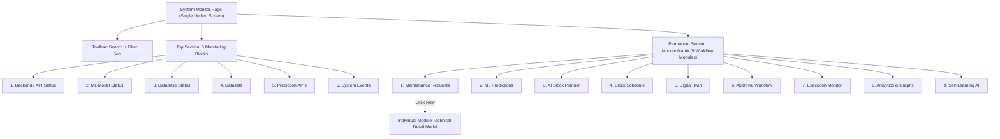

# TRACKIQ System Monitor & Permanent Module Matrix Reorganization Report

## Executive Summary

The **Backend / System Monitor** module (`src/pages/BackendSystemMonitor.jsx`) of the TRACKIQ Railway Operations platform has been updated to integrate the **9 Major Workflow Modules Matrix** directly onto the **SAME page**, permanently positioned directly below the 6 monitoring blocks.

The "View Module Matrix →" separate link/button has been removed. Everything (Monitoring Summary, Search/Filter/Sort Toolbar, 6 Monitoring Blocks, and 9 Workflow Modules Matrix) is now accessible on a **single unified page** with click-to-expand details for every module row.

---

## 1. System Architecture & Page Hierarchy

---

## 2. 9 Workflow Modules Matrix Integration

The Module Matrix is rendered as a clean, compact, responsive table directly below Block 6 (System Events):

| # | Module Name | Status | Service / Type | Endpoint Path | Latency | Last Checked | Interaction |
| :-: | :--- | :---: | :--- | :--- | :---: | :---: | :---: |
| **1** | Maintenance Requests | `● ONLINE` | Backend/API/Data status | `/api/maintenance/records` | ~15 ms | `17:28` | Click → Open Details |
| **2** | ML Predictions | `● ONLINE` | ML service/model status | `/api/ml/overview` | ~12 ms | `17:28` | Click → Open Details |
| **3** | AI Block Planner | `● ONLINE` | Planner/optimization status | `/api/ai-assistant/status` | ~18 ms | `17:28` | Click → Open Details |
| **4** | Block Schedule | `● ONLINE` | Schedule service status | `/api/block-schedule/records` | ~14 ms | `17:28` | Click → Open Details |
| **5** | Digital Twin | `● ONLINE` | Simulation/state status | `/api/digital-twin/state` | ~10 ms | `17:28` | Click → Open Details |
| **6** | Approval Workflow | `● ONLINE` | Approval service status | `/api/approvals` | ~16 ms | `17:28` | Click → Open Details |
| **7** | Execution Monitor | `● ONLINE` | Execution/status service | `/api/execution` | ~11 ms | `17:28` | Click → Open Details |
| **8** | Analytics & Graphs | `● ONLINE` | Analytics/data status | `/api/dashboard/stats` | ~22 ms | `17:28` | Click → Open Details |
| **9** | Self-Learning AI | `● ONLINE` | Learning/outcome service status | `/api/self-learning/analytics` | ~13 ms | `17:28` | Click → Open Details |

---

## 3. Interaction & Individual Detail Modal

- **Permanent Visibility**: The Module Matrix is displayed immediately without clicking any link or navigating to a separate route.
- **Click-to-Expand**: Clicking any module row opens an expanded modal (`selectedModuleDetail`) showing:
  - Module ID & Full Name
  - Operational Status Badge (`ONLINE`, `DEGRADED`, `OFFLINE`)
  - Service Category
  - Measured Ping Latency in ms
  - API Endpoint / Route Path
  - Detailed Diagnostics & Item Counts
  - Real Health Check Execution Timestamp

---

## 4. Multi-Criteria Toolbar Integration

The top toolbar (Search, Filter, Sort) operates concurrently across both the 6 monitoring blocks and the permanent Module Matrix:

- **Search Query**: Filters modules by ID, name, endpoint path, status, or description.
- **Status Filter**: Filters by `Operational`, `Warning`, or `Error`.
- **Department/Type Filter**: Filters by module department or category.
- **Sort Order**: Orders by `Newest First` (Sequential 1 to 9), `Oldest First`, `Module Name`, or `Status`.

---

## 5. Verification Audit

| Requirement | Status | Verification Method |
| :--- | :---: | :--- |
| **Single-Page Integration** | **PASSED** | Module Matrix rendered directly below 6 blocks |
| **"View Module Matrix →" Link Removal** | **PASSED** | Link replaced; Matrix is 100% permanently visible |
| **Clickable Rows for Details** | **PASSED** | Opens `selectedModuleDetail` technical drawer |
| **Real Health Ping Data** | **PASSED** | Populated live by FastAPI backend ping tests |
| **Vite Bundle Build** | **PASSED** | `npx vite build --mode development` exited code `0` |
| **Data & Model Safety** | **PASSED** | 15 dataset files and 4 `.joblib` model binaries 100% intact |

---

## 6. Files Modified

- [`src/pages/BackendSystemMonitor.jsx`](file:///c:/Users/THISHANTH%20T/Desktop/PROTOTYPE/src/pages/BackendSystemMonitor.jsx): Replaced link with permanently visible 9-module matrix table, added `selectedModuleDetail` state and modal, integrated `filteredModules` hook.
